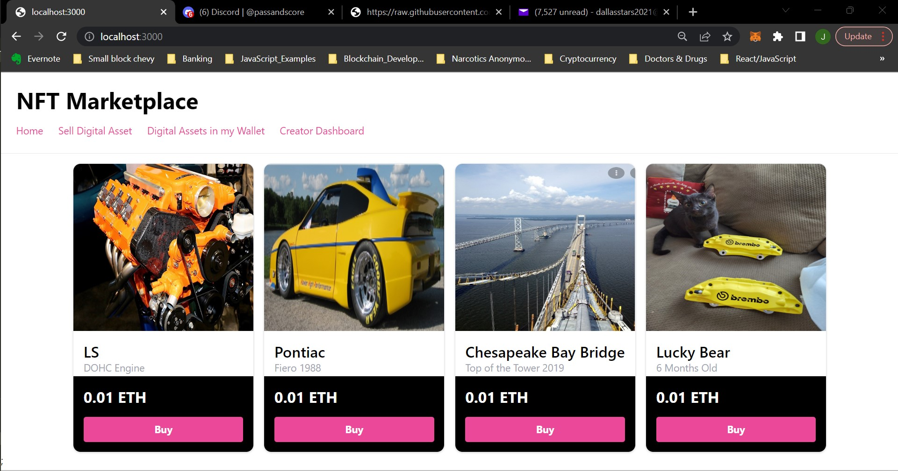

# NFT Marketplace - Dencentralized Application (DApp)

<!-- ABOUT THE PROJECT -->

## About The Project

Implemented a NFT Marketplace based on a Decentralized Application using Next.js and Goerli testnet.The purpose of this application is to allow users to create digital assets (NFT's), and also afterwards they have the option to put those NFT's on the NFT Marketplace for purchasing. This project was written in JavaScript and Solidity.

## What I learned

This was my first time implementing Next.js, Tailwind CSS, and Hardhat. Also deploying to the Goerli testnet network was kind of a first because I had already deployed smart contracts on Remix IDE using Goerli network, just never creating NFT's using ipfs. Deploying through Hardhat was a simple process.

### Languages

- [Solidity](https://docs.soliditylang.org/en/v0.8.9/)
- [JavaScript](https://www.javascript.com/)

## Built With

- [Goerli](https://goerli.net/)
- [Ethers](https://docs.ethers.io/v5/)
- [Hardhat](https://hardhat.org/)
- [MetaMask](https://metamask.io/)
- [nft.storage](https://nft.storage//)
- [Next.js](https://nextjs.org/)
- [Tailwind](https://tailwindcss.com/)

## Reccommended Dependencies

- [Web3 Modal](https://www.npmjs.com/package/web3modal)
- [React Toastify](https://github.com/fkhadra/react-toastify#readme)
- [Solidity Coverage](https://www.npmjs.com/package/solidity-coverage)

## Smart Contract 
#### Security
- I used re-entrancy guard from the open zeppelin library(nonReentrant).

#### Functionality
-I only used the blockchain for the parts of the Dapp that require decentralization. 
-I kept the functions small and clean. 
-I used contracts and code that was already written, where possible. No need to re-invent the wheel. 
-I also kept the smart contract logic fairly simple, no need to over complicate. 

